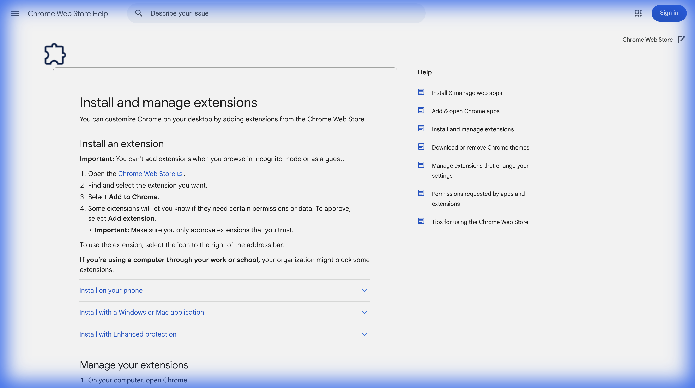

# 🧠 NMT Interface Enhancer

Welcome! This is a little Chrome Extension to make the NMT reporting site much easier and nicer to use. 

It adds:
- 🎨 **Better UI**: Turns those tiny dropdowns into easy-to-use **sliders** and **buttons**.
- 🚀 **Quick Navigation**: Jump between Part A, B, C, and D instantly with a sidebar.
- 📊 **Progress Tracking**: See exactly how much you've done with a progress bar and filling buttons.
- 🐦 **Daily Bird**: A consistent, calming bird background specific to each report.

---

## 🛠️ How to Install (Mac/PC)

You don't need to be a coder to install this! Just follow these steps:

### 1. Download the Code 📥
Click the green **Code** button above and select **Download ZIP**. 
Unzip the folder somewhere easy to find (like your Desktop).

### 2. Open Chrome Extensions 🧩
1. Open Google Chrome.
2. In the address bar at the top, type: `chrome://extensions` and hit Enter.
3. Or, click the **Puzzle Piece** icon  in the top-right -> **Manage Extensions**.

### 3. Turn on "Developer Mode" 🔧
In the top-right corner of the Extensions page, you'll see a toggle switch called **Developer mode**. 
**Turn it ON!** (The toggle should be blue).

### 4. Load the Extension 📂
1. Look for a new button that appeared in the top-left called **Load unpacked**.
2. Click it!
3. Select the folder you unzipped in Step 1 (make sure you select the folder that contains `manifest.json`).

### 5. You're Done! 🎉
Go to the NMT Report page and refresh. You should see the new sidebar and background!

---

## 💡 How to Use

- **Sidebar**: Click A, B, C, or D to jump to that section.
  - The buttons will **fill up with color** as you answer questions!
  - 🟢 **Green** means that section is 100% complete.
- **Sliders**: Drag the blue dot to set your score (1-12).
- **Buttons**: Click "High", "Moderate", or "Low" for confidence.
- **Progress Bar**: Look at the bottom of the screen to see your total progress for the current page.

---

*Made with ❤️ for the NMT community.*
